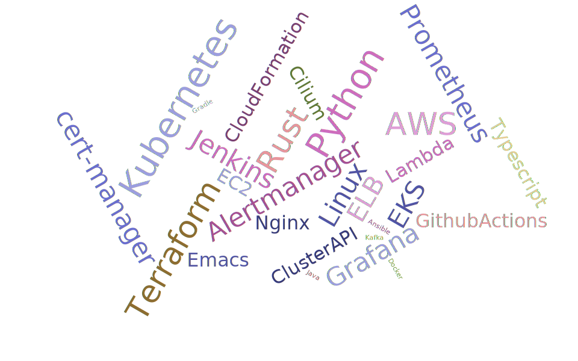

# Hello, World!

Since I graduated in 2017 I've been working as a software engineer with a focus on back end systems and DevOps. I love digging in to new systems to discover how they work and trying to implement them myself.

- 📖 Currently learning: Machine Learning, emulator development, emacs
- 🔨 Currently working on: Fast AI course part 2
- 💬 Let's chat: emacs, rust, emulators

